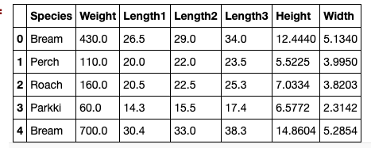
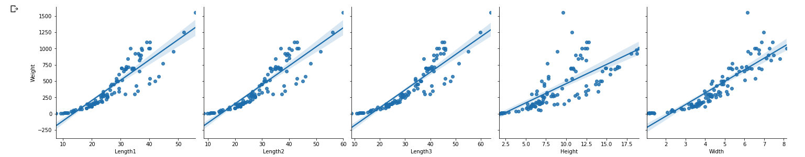
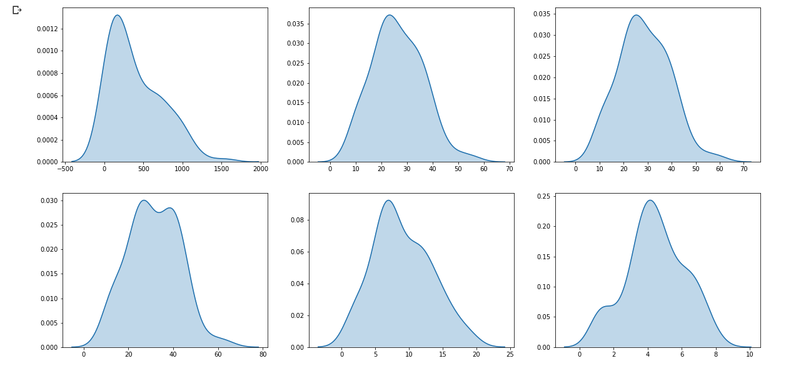
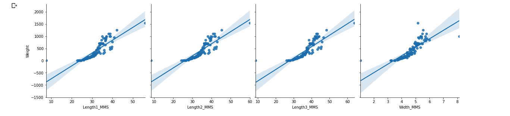
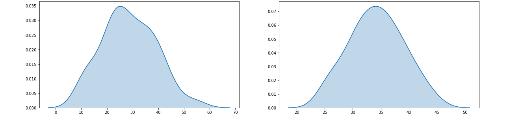
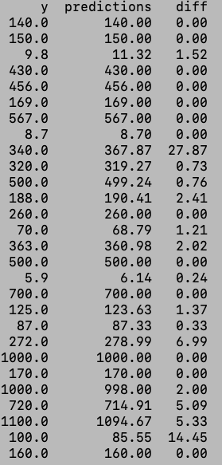

# 14-ML-challenge

## **Requirement**
1. Predict fish weight based on features like length, height and width.
2. It will be a holdout of 30% of the original data.
3. Compare different regression models.
4. Get the lowest mean square error on the final prediction.

## **Raw Data Preview**

## **Raw Data Linearity**

## **Raw Data Distribution**

## **Preprocess**
### Removing Outliers
1. Removing outliers by feature and species using ***IsolationForest***.
2. Replace outliers with mean by feature and specie.

### Calculated Fields
1. Lmax = Max(Length1, Length2, Length3)
2. Volume = Lmax * Height * Width
3. Mass =  Density * Volume
4. Lavg = Avg(Length1, Length2, Length3)

### Normalize
1. Using ***QuantileTransformer*** to fit a normal distribution.
2. Using ***MaxMinScaler*** to adjust the data back to its original min and max range.

## **Final Data Linearity**

## **Final Data Distribution  (Raw v. Final)**

## **Feature Selection** 
1. Calculate feature correlation v. Weight.
2. Selected features with correlation greater then 74%.

## **Model Evaluation and Accuracy**
1.  LinearRegression: 54.56%
2.  Lasso: 57.67%
3.  Ridge: 29.59%
4.  OrthogonalMatchingPursuit: 51.06%
5.  RandomForestRegressor: 96.95%
6.  GradientBoostingRegressor: 97.54%
7.  KernelRidge: 28.37%
8.  PLSRegression: 58.84%
9.  BayesianRidge: 28.14%
10. ElasticNet: 24.15%
11. BayesianRidge: 29.29%
12. ExtraTreesRegressor: 99.85%

## **Model Training**
1. Train Size: ***76%***
2. Test Size: ***33%***
3. Model Accuracy: ***99.85%***
4. Model Strategy: ***ExtraTreeRegressor***

## **Prediction**
1. mse: ***39.83***

